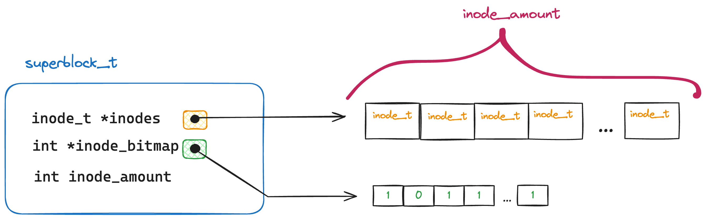
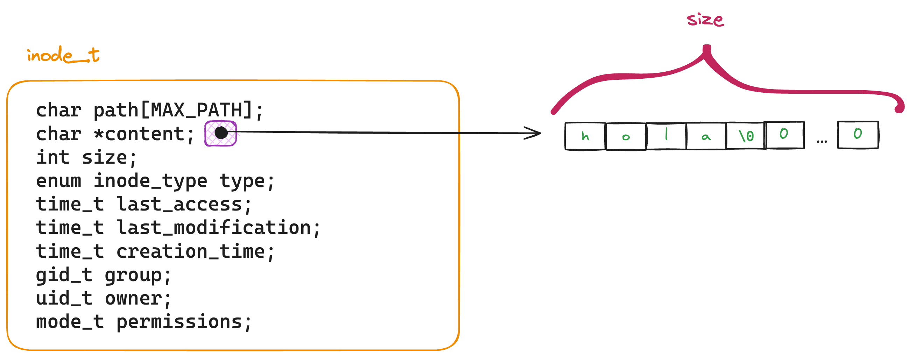
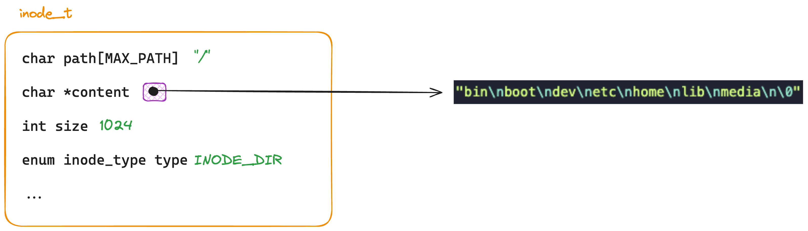
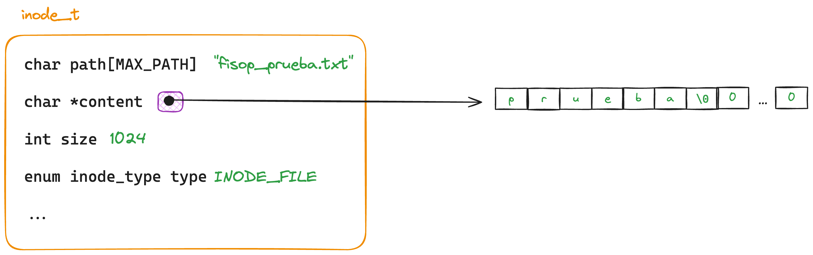
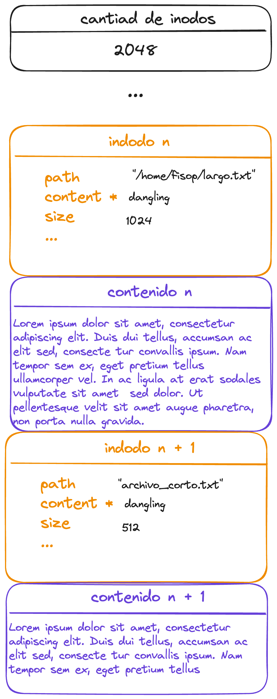

# fisop-fs

## Estructuras

### Superbloque

Para representar nuestro fs se creo una estructura de superbloque para guardar la informacion de los inodos y el bitmap de bloques libres.

```c
typedef struct superblock {
	inode_t *inodes;
	int *inode_bitmap;
	int inode_amount;
} superblock_t;
```

Donde `inodes` es un puntero a un array de inodos y `inode_bitmap` es un puntero a un array de enteros que representa los bloques libres. El `inode_amount` es la cantidad de inodos que se pueden guardar en el superbloque. Este ultimo valor se guarda ya que el array de inodos es dinamico y se puede agrandar.



### Inodos

Se modelaron los archivos y directorios en forma de inodos similar a la Linux.

```c
enum inode_type { INODE_FILE, INODE_DIR };

typedef struct inode {
	char path[MAX_PATH];
	char *content;
	int size;
	enum inode_type type;
	time_t last_access;
	time_t last_modification;
	time_t creation_time;
	gid_t group;
	uid_t owner;
	mode_t permissions;
} inode_t;
```

Donde el `content` de un archivo es un puntero a un buffer de memoria que contiene el contenido del archivo guardado como string (ya que termina en `\0`) y el `size` representa el tamaño del buffer porque el mismo es dinamico. El resto del buffer siempre contiene 0's ya que se alloca con `calloc` como se puede ver en el digrama.



#### Inodo de directorio

Como nombramos anteriormente los inodos pueden ser de tipo archivo o directorio. Para representar las entradas de un directorio se tomo como referencia los dentries de Linux. Dentro del contenido de un inodo de tipo directorio se guarda en el buffer de contenido una lista de dentries, donde cada dentry esta separado por un `\n` y como especificamos anteriormente, termina en `\0`. De esta forma nos permite tener muchos niveles de directorios de forma sencilla.



#### Inodo de archivo

Para los inodos de tipo archivo se guardan los datos del archivo en el buffer de contenido. El buffer se alloca con `calloc` para que los datos que no se escribieron sean 0's.



## Busqueda de archivos por path

Para realizar la busqueda de archivos por path simplemente se itera sobre el vector de los inodos, y se busca aquellos que tengan el mismo path que el que se esta buscando y en el bitmap tengan `1` en su posicion. Se tomo esta desicion ya que es mas sencillo y rapido que buscar en un arbol de directorios, dado que para las funcionalidades base esto no aportaria demasiado. Si en un futuro decidimos agregar las funcionalidades del punto extra, es posible que se refactorice para que cada dentry contenga nombre y puntero al inodo correspondiente, desacoplando el path de la estructura del inodo y obligandonos a realizar busqueda por directorio.

## Persistencia en disco

### Serializacion

Para guardar el contenido del fs en disco se serializan unicamente los inodos activos (con 1 en bitmap), es por esto que en primer lugar se recorre el vector de inodos y se cuenta la cantidad de inodos activos.

Luego arranca la escritua en disco, primero se escribe la cantidad de inodos activos y despues de eso se recorren todos los inodos, si el inodo esta activo se escribe en disco, si no se saltea. Para cada inodo se escribe inmediatamente despues el contenido del inodo, donde la cantidad de bytes a escribir es `inodo->size`, sin importar si el largo del contenido es menor a `size`, esto es asi a la hora de leer el archivo se sabe cuantos bytes leer.

Si vemos como quedan las estructuras en el disco, seria algo asi:



Cabe destacar que la forma de serializacion de los directorios y archivos es la misma, ya que ambas tienen su informacion en el buffer de contenido.

### Guardado del archivo

Un detalle a tener en cuenta sobre el guardado del archivo a disco (`fs.fisop`) es que si se corre en background, el archivo no sera guardado en donde se corrio el comando, sino en `/` ya que el proceso se corre en background y no tiene un directorio de trabajo, en cambio si se corre en foreground el archivo del filesystem sera guardado en el directorio donde se ejecuto el comando. Este funcionamiento es el detallado en el articulo que se encuentra en la consigna del tp ([link al articulo](https://www.cs.hmc.edu/~geoff/classes/hmc.cs135.201109/homework/fuse/fuse_doc.html#compiling:~:text=writes%20work%20correctly.-,Working%20directory,-When%20it%20starts)).
