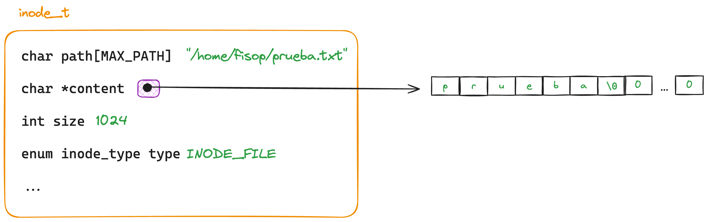

# fisop-fs

## Estructuras

### Superbloque

Para representar nuestro fs se creo una estructura de superbloque para guardar la informacion de los inodos y el bitmap de bloques libres.

```c
typedef struct superblock {
	inode_t *inodes;
	int *inode_bitmap;
	int inode_amount;
} superblock_t;
```

Donde `inodes` es un puntero a un array de inodos y `inode_bitmap` es un puntero a un array de enteros que representa los bloques libres. El `inode_amount` es la cantidad de inodos que se pueden guardar en el superbloque. Este ultimo valor se guarda ya que el array de inodos es dinamico y se puede agrandar.


### Inodos

Se modelaron los archivos y directorios en forma de inodos similar a la Linux.

```c
enum inode_type { INODE_FILE, INODE_DIR };

typedef struct inode {
	char path[MAX_PATH];
	char *content;
	int size;
	enum inode_type type;
	time_t last_access;
	time_t last_modification;
	time_t creation_time;
	gid_t group;
	uid_t owner;
	mode_t permissions;
} inode_t;
```

Donde el `content` de un archivo es un puntero a un buffer de memoria que contiene el contenido del archivo guardado como string (ya que termina en `\0`) y el `size` representa el tamaño del buffer porque el mismo es dinamico. El resto del buffer siempre contiene 0's ya que se alloca con `calloc` como se puede ver en el digrama.


#### Inodo de directorio

Como nombramos anteriormente los inodos pueden ser de tipo archivo o directorio. Para representar las entradas de un directorio se tomo como referencia los dentries de Linux. Dentro del contenido de un inodo de tipo directorio se guarda en el buffer de contenido una lista de dentries, donde cada dentry esta separado por un `\n` y como especificamos anteriormente, termina en `\0`.


#### Inodo de archivo

Para los inodos de tipo archivo se guardan los datos del archivo en el buffer de contenido. El buffer se alloca con `calloc` para que los datos que no se escribieron sean 0's.


